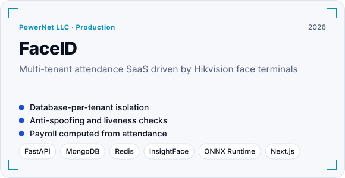
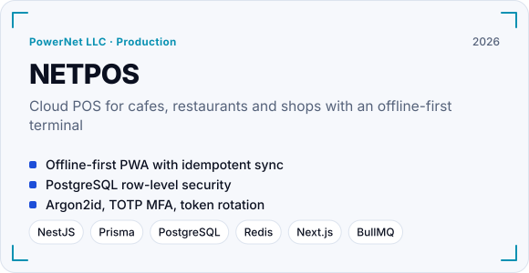
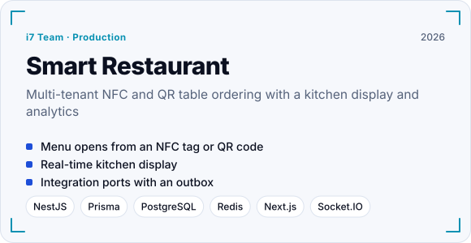
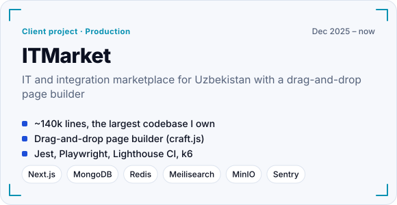
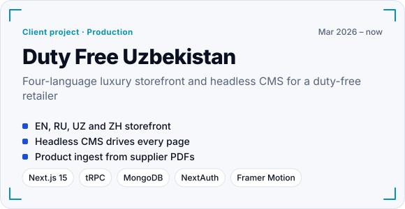
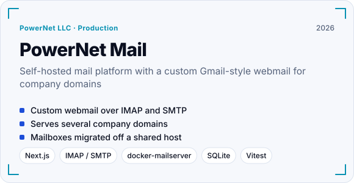
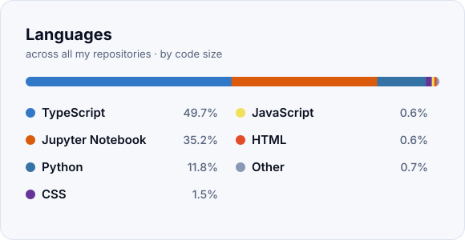

<picture><source media="(prefers-color-scheme: dark)" srcset="assets/header-dark.svg"></picture>

<b>Full-Stack &amp; AI Engineer</b> · Head of IT Department @ PowerNet · Founder @ i7 Team · Tashkent, Uzbekistan

## About

- **Head of IT Department** at [PowerNet](https://powernet.uz), one of Uzbekistan's leading system integrators. I lead in-house engineering and build the company's product line: FaceID, NETPOS, PowerNet Mail and Sklad.
- **Founder** of [i7 Team](https://i7team.uz), a product studio for web apps, premium websites and ML solutions. Full-stack engineer for [dutyfree.uz](https://dutyfree.uz) and [ITMarket](https://itmarket.uz).
- I ship complete systems: multi-tenant SaaS backends, real-time and offline-first web apps, face-recognition attendance with anti-spoofing, and self-hosted mail and e-commerce platforms.
- **BSc Computer Science** at Westminster International University in Tashkent (2024–2028), researching U-Net based retinal lesion segmentation.
- **Open to Full-Stack / AI Engineer roles** — remote or Tashkent.

## Tech stack

<picture><source media="(prefers-color-scheme: dark)" srcset="assets/stack-dark.svg"></picture>

## Featured work

<a href="https://github.com/Timberlake-coder/faceid-attendance-saas"><picture><source media="(prefers-color-scheme: dark)" srcset="assets/card-faceid-attendance-saas-dark.svg"></picture></a>
<a href="https://github.com/Timberlake-coder/netpos-cloud-pos"><picture><source media="(prefers-color-scheme: dark)" srcset="assets/card-netpos-cloud-pos-dark.svg"></picture></a>
<a href="https://github.com/Timberlake-coder/smart-restaurant-platform"><picture><source media="(prefers-color-scheme: dark)" srcset="assets/card-smart-restaurant-platform-dark.svg"></picture></a>
<a href="https://github.com/Timberlake-coder/itmarket-ecommerce"><picture><source media="(prefers-color-scheme: dark)" srcset="assets/card-itmarket-ecommerce-dark.svg"></picture></a>
<a href="https://github.com/Timberlake-coder/dutyfree-storefront"><picture><source media="(prefers-color-scheme: dark)" srcset="assets/card-dutyfree-storefront-dark.svg"></picture></a>
<a href="https://github.com/Timberlake-coder/powernet-mail-platform"><picture><source media="(prefers-color-scheme: dark)" srcset="assets/card-powernet-mail-platform-dark.svg"></picture></a>

## More projects

| Project | What it is |
|---|---|
| [**Sklad**](https://sklad.powernet.uz) | Warehouse and inventory system with real-time stock updates and Excel export — Express, PostgreSQL, Socket.IO, Next.js. |
| [**Shahnoza Fayz Medical Center**](https://shahnozafayz.uz) | Trilingual clinic website with a headless CMS (Tiptap editor, revisions, media library), Telegram lead notifications, analytics and SEO. |
| [**Vkuslandiya by Ayva**](https://vkuslandiya.uz) | Zero-dependency trilingual site for a 12-branch confectionery chain, with size-budgeted builds and link and image probes in CI. |
| [**i7 Team**](https://i7team.uz) | Studio website with GSAP, Lenis and three.js motion, admin dashboard, traffic analytics and JSON-LD SEO. |

## Activity

<picture><source media="(prefers-color-scheme: dark)" srcset="assets/langs-dark.svg"></picture>

<picture><source media="(prefers-color-scheme: dark)" srcset="https://raw.githubusercontent.com/Timberlake-coder/Timberlake-coder/output/snake-dark.svg"></picture>

## Connect

<a href="https://t.me/wtrillionairew"><picture><source media="(prefers-color-scheme: dark)" srcset="assets/btn-telegram-dark.svg"></picture></a> <a href="mailto:kadirjanovozod8@gmail.com"><picture><source media="(prefers-color-scheme: dark)" srcset="assets/btn-email-dark.svg"></picture></a> <a href="https://i7team.uz"><picture><source media="(prefers-color-scheme: dark)" srcset="assets/btn-web-dark.svg"></picture></a>

Text version of the graphics

**Impact** — **20+** production codebases in 10 months · **~140k** lines in ITMarket, my largest codebase · **0.91** Dice on retinal vessel segmentation · **4** UI languages shipped: EN, RU, UZ, ZH

**Languages** — TypeScript, Python, SQL, Go, Bash, Swift, Kotlin, Dart  
**Backend** — NestJS, FastAPI, Express, Prisma, tRPC, Socket.IO, BullMQ, Mongoose  
**Frontend** — Next.js, React 19, Tailwind, shadcn/ui, Framer Motion, GSAP, three.js, PWA  
**Data** — PostgreSQL, MongoDB, Redis, Meilisearch, MinIO / S3, IndexedDB  
**ML & Computer Vision** — PyTorch, U-Net, Mask R-CNN, EfficientNet, InsightFace, MiniFASNet, ONNX Runtime, OpenCV  
**Security & DevOps** — Docker, GitHub Actions, GHCR, Caddy, Let's Encrypt, Argon2id, TOTP MFA, Sentry  

**Featured work**

- [FaceID](https://github.com/Timberlake-coder/faceid-attendance-saas) — Multi-tenant attendance SaaS driven by Hikvision face terminals
- [NETPOS](https://github.com/Timberlake-coder/netpos-cloud-pos) — Cloud POS for cafes, restaurants and shops with an offline-first terminal
- [Smart Restaurant](https://github.com/Timberlake-coder/smart-restaurant-platform) — Multi-tenant NFC and QR table ordering with a kitchen display and analytics
- [ITMarket](https://github.com/Timberlake-coder/itmarket-ecommerce) — IT and integration marketplace for Uzbekistan with a drag-and-drop page builder
- [Duty Free Uzbekistan](https://github.com/Timberlake-coder/dutyfree-storefront) — Four-language luxury storefront and headless CMS for a duty-free retailer
- [PowerNet Mail](https://github.com/Timberlake-coder/powernet-mail-platform) — Self-hosted mail platform with a custom Gmail-style webmail for company domains

